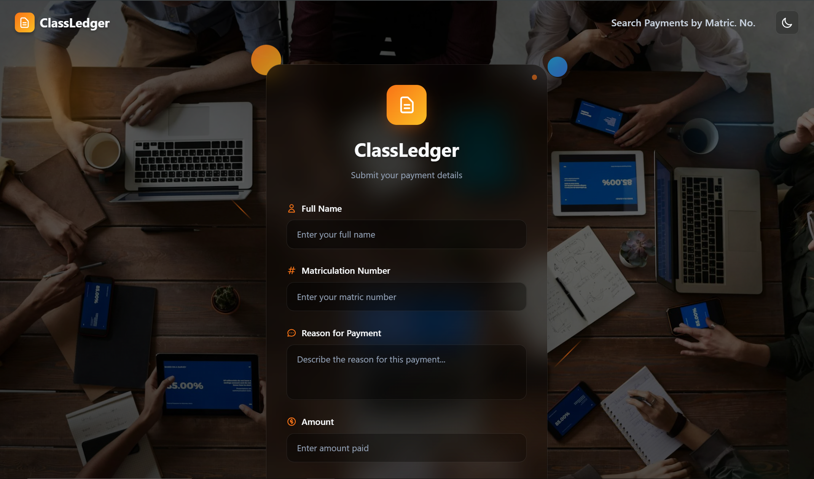
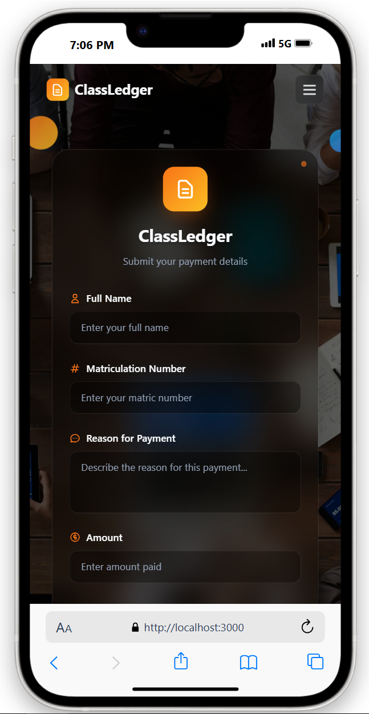
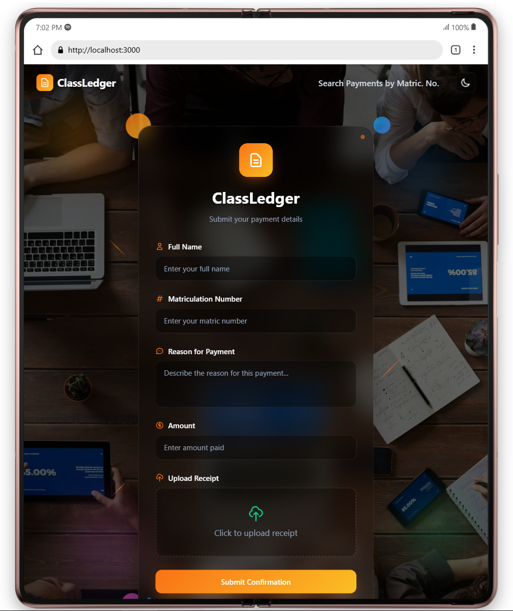
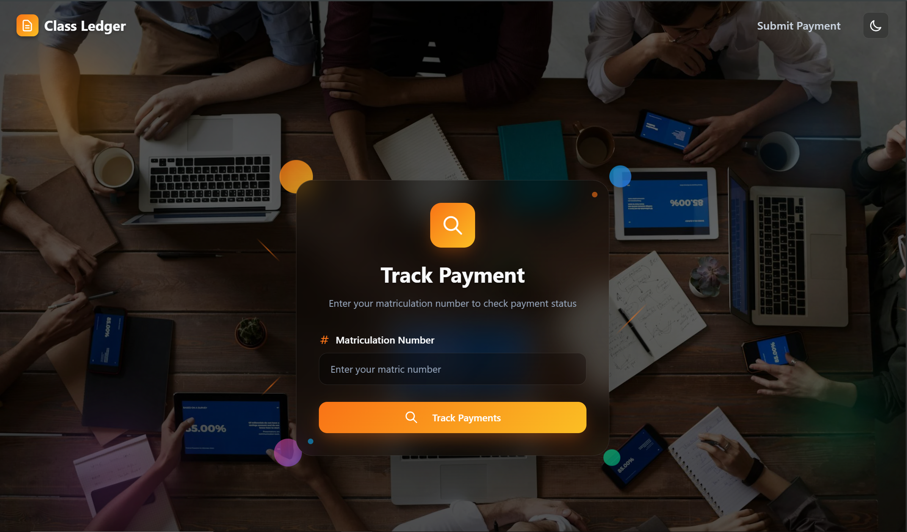
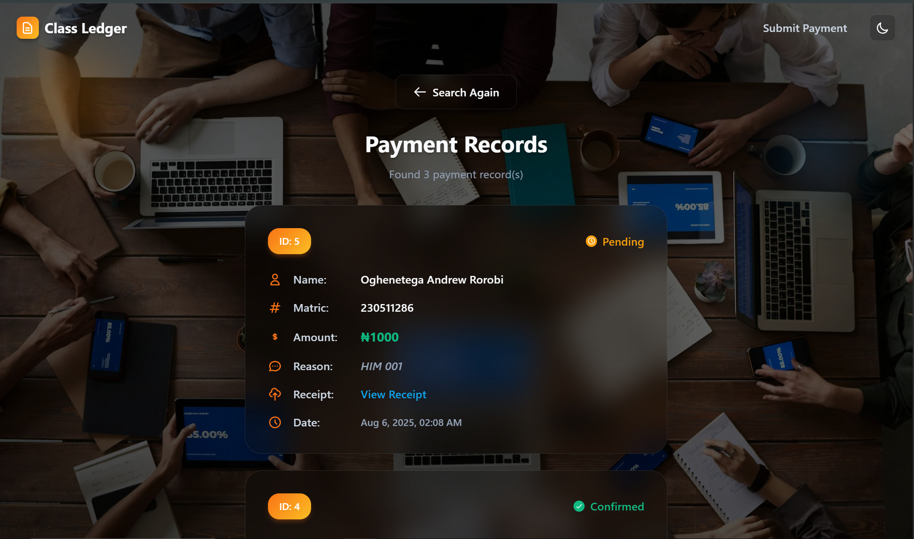

# Class Ledger 📝

### A Secure and Efficient Payment Tracking System for Students 🧑‍🎓

**Introduction**

Class Ledger is a purpose-built web application to solve the common problem of organizing student payments within a university department. It was created to replace a messy, time-consuming, and manual process that relied on WhatsApp DMs and manual record-keeping. The application provides a secure, private, and efficient platform for both the class head and the students. 🚀

**Preview**

   
   
   

   
  

**Problem Statement**

In many university classes, collecting payments for levies, manuals, or events is a chaotic process. The typical workflow involves students sending receipt images and personal details via WhatsApp DMs. This leads to:

* **Inefficiency:** The class head spends hours sifting through hundreds of messages to confirm payments and manually update records. 😩
* **Disorganization:** Important messages get lost in the flood of payment confirmations. 😵‍💫
* **Privacy Concerns:** Using spreadsheets for tracking can expose sensitive information like students' names and payment status to the entire class. 🤫
Omo.

**Solution**

Class Ledger addresses these issues by providing a streamlined, automated solution. The application consists of three main components:

1.  **Payment Submission Page:** A clean, user-friendly form where students can submit all necessary information—full name, matriculation number, reason for payment, and a receipt image—in one place. 🧾
2.  **Payment Confirmation Admin Panel:** A private, password-protected dashboard (powered by the Django Admin) for the class head. This interface presents all submitted payments in a clear, ordered list, allowing for easy confirmation with a simple checkbox. The list is automatically sorted to show the latest submissions first. ✅
3.  **Individual Payment Tracker:** A dedicated page where students can enter their matriculation number to securely and privately check the confirmation status of their payment without viewing anyone else's information. 🕵️‍♂️

**Technology Stack 🛠**

The application is built on a robust and scalable technology stack:

* **Backend:**
    * **Django:** A high-level Python web framework for rapid development and clean design. 🐍
    * **Django REST Framework:** Used to create the API endpoints for payment submission and status tracking.
* **Frontend:**
    * **HTML, CSS, JavaScript:** A lightweight and performant frontend using standard web technologies. ✨

